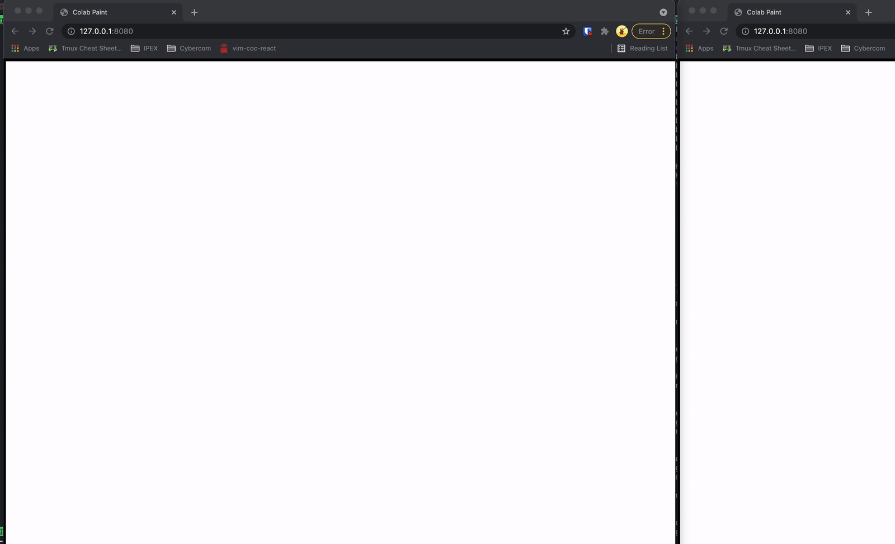
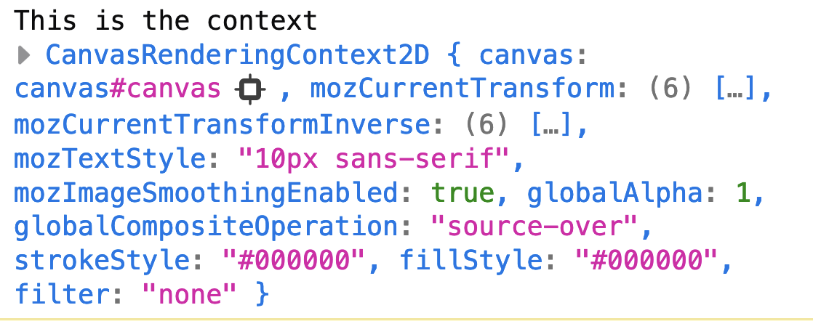
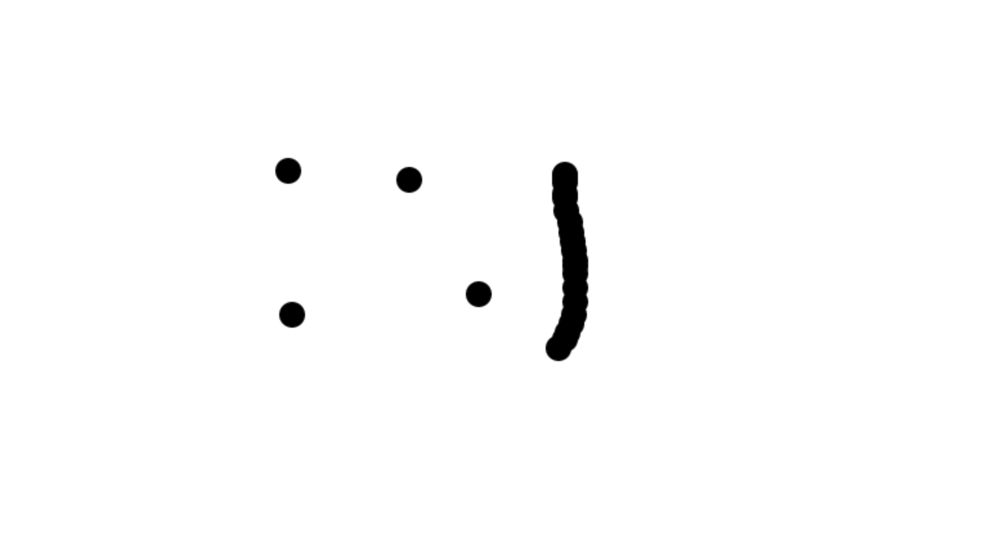

# My Collab Paint Walk through

This tutorial is going to build on the what we have learnt about websockets and canvas to create a simple collaborative paint canvas.



We will use WebSocket library [ws](https://github.com/websockets/ws)
and together with the [canvas API](https://developer.mozilla.org/en-US/docs/Web/API/Canvas_API) to draw on our canvas

## Scope
- This app will handle connections on the local machine. 
- Each time a connection is made the server creates an user id and color for the client. 
- The client can only make draw small circles with radius of 10.
- The canvas will only resize during first load
- A client connecting later will receive a state of the canvas to sync

## Step 1: Inital project structure
Here we follow [Anders first tutorial](https://github.com/andsju/Tutorial-Nodejs-WebSocket-Lab) and start of like this:

```js
| ─ server.mjs
| ─ public
|   └─ index.html
```

# Step 2: Create a local paint application
Once this is complete we can create a local paint application

**index.html -> Create a canvas in body**
```html
<body>
  <canvas id='canvas'></canvas>
</body>
```

**Optional: public/style.css -> style canvas and remove defauly margin and padding**
```css
* {
  box-sizing: border-box;
  margin: 0;
  padding: 0;
}

canvas {
  border: 5px solid black;
}

```

You can also just steal `style.css` from this repo. Dont forget to link the stylesheet in head.

# Step 2.2: Scaffold script.js for hold canvas logic
```js
function init(e) {
  // TODO: Setup Canvas 

  // TODO: Handle painting

  // TODO: Setup websocket

  // TODO: Handle socket events

  // TODO: Connecting events with functions
}

window.onload = init;
```

# Step 2.3: Setup canvas context
```js
function init(e) {
  // DONE: Setup Canvas 
  const canvas = document.querySelector("#canvas");
  canvas.width = window.innerWidth;
  canvas.height = window.innerHeight;
  const ctx = canvas.getContext("2d");
  ...
```

You need to access the element from the DOM and then ask for the 2d context to be able to paint on it. Also to resize it is the window size is a good idea.

# Step 2.3: Setup canvas context
```js
function init(e) {
  // DONE: Setup Canvas 
  const canvas = document.querySelector("#canvas");
  canvas.width = window.innerWidth;
  canvas.height = window.innerHeight;
  const ctx = canvas.getContext("2d");
  // console.log('This is the context', ctx);
  ...
```
You need to access the element from the DOM and then ask for the 2d context to be able to paint on it. Also to resize it is the window size is a good idea. Log the context to the conole and you should get something like this:



## Step 2.4: Painting
```js
function init(e) {
  // DONE: Setup Canvas 
  ...
  // DONE: Handle painting
  let isPainting = false;
  const initPaint = (e) => {
    isPainting = true;
    paint(e); // needed to be able to make dots
  };

  const finishPaint = () => {
    isPainting = false;
  };

  const paint = (e) => {
    if (!isPainting) return;
    ctx.arc(e.clientX, e.clientY, 10, 0, 2*Math.PI); // Draw 10px radius circle
    ctx.fill() // hmmm... 
    // Perhaps something else needed?
  };
  
  ...

  // TODO: Connecting events with functions
  canvas.onmousedown = initPaint
  canvas.onmousemove = paint
  canvas.onmouseup = finishPaint
```

Here we need to handle events for starting, stopping and doing painting. Since we only want to paint when we have are pressing our mouse down we set a flag `isPainting` to true when we start pressing the mouse, triggering `canvas.onmousedown`. The `canvas.onmousemove` event is trigged as soon as we move the mouse (try it yourselves!). Using the flag we can do an early exit if not pressing the mouse down. The same approach goes releasing your mouse button. The flag is set to false when the mouse is being released, triggering `canvas.onmouseup`.

Notice anything strange when running the code? Does it look like this?


What is happening? Well what `ctx.fill(...)` is doing a connection with the start point in order to fill. To stop this add a `ctx.beginPath()` after `ctx.fill()`



You should now be done with step 2. Take a break. Go outside or have a chat with your mum. She loves you.


# Step 3: Get the server talking
Assuming you have done [Anders nice tutorial](https://github.com/andsju/Tutorial-Nodejs-WebSocket-Lab). We know how the basics looks like.

**server.mjs**
```js
import {WebSocketServer} from 'ws'; // if not installed -> npm i ws 
// create WebSocket server
const wss = new WebSocketServer({ port: 8081 });

// listen to WebSocket server (wss) connections
wss.on("connection", (ws) => {
  console.log(`Client connected from IP ${ws._socket.remoteAddress}`);
  console.log(`Number of connected clients: ${wss.clients.size}`);

  // close event
  ws.on("close", () => {
    console.log("Client disconnected\n");
  });

  // message event
  ws.on("message", (data) => {
    console.log("Message received: ", data);
    // TODO: handle paint messages for all connected
  });
});

```
Below you see the basic for setting up a websocket server. `wss.on("connection", functionA)` will trigger `functionA` on every connection made on port 8081. Inside we also make sure that `ws.on('close', functionB)` and `ws.on('message', functionC)` is setup were the function are for now just logging out information about what just happened.

Verify that everything works by starting the server `node server.mjs` and then start a browser and write in the dev tools console:

**Browser Dev Tools Console**
```js
const websocket = new WebSocket('ws://localhost:8081');
websocket.send("Hello from client!"}));
undefined
```

and in the terminal of the node server:
**Node server Terminal**
```js
Client connected from IP ::ffff:127.0.0.1
Number of connected clients: 1
Message received: Hello from client!
```

Try now to add a message return from the server to answer the client.

**server.mjs**
```js
  ...
  // message event
  ws.on("message", (data) => {
    console.log("Message received: ", data);
    ws.send("Hello back from server!");
    // TODO: handle paint messages for all connected
  });
  ...
```

**public/script.js**
```js
  function init(e) {
    const websocket = new WebSocket('ws://localhost:8081');

    ...
    // TODO: Handle socket events
    const handleSocketOpen = (e) => {
      console.log('Socket has been opened');
    };
    const handleSocketMessage = (e) => {
      console.log('From server:', e.data);
    };
    
    // DONE: Connecting events with functions
    websocket.onopen = handleSocketOpen;
    websocket.onmessage = handleSocketMessage;
    canvas.onmousedown = initPaint
    canvas.onmousemove = paint
    canvas.onmouseup = finishPaint
  });
```

Running it now again should give back a response in like so:

```
const websocket = new WebSocket('ws://localhost:8081');
websocket.send("Hello from client!"}));
undefined
Hello back from server!
```

# Step 3: Give the server authority to paint
So until now we should have a working client paint app but it is working without anyone else collaborating with it. The server can receive and reply with messages. What we want to is to give *each client a unique color* and broadcast to *each client when they are painting*

First we will pull the painting of a circle out from `paint()` in `public/script.js`. We will let the server know we want to draw and later hope for a response that triggers the actuall drawing. Let me show you:

**public/script.js**
```js
function init(e) {
  ...
  const paint = (e) => {
    if (!isPainting) return;
    const args = {x: e.clientX, y: e.clientY, radius:10, startAngle:0, endAngle: 2 * Math.PI};
    websocket.send(JSON.stringify({ type: "paint", payload: args }));
    //MOVE LINE -> ctx.arc(e.clientX, e.clientY, 10, 0, 2 * Math.PI); // Draw 10px radius circle
    //MOVE LINE -> ctx.fill();
    //MOVE LINE -> ctx.beginPath();
  };

  ...
  const handleSocketMessage = (e) => {
    const message = JSON.parse(e.data);
    log(`Message incoming: ${message}`);
    switch (message.type) {
      case "paint":
        const args = message.payload;
        paintDot(ctx, args); // <--- Client paints only when told by server
        break;
      default:
        console.log("default case...");
    }
  }

  ...
}

// MOVE THEM TO THIS NEW FUNCTION HERE
function paintDot(ctx, args) {
  ctx.arc(args.x, args.y, args.radius, args.startAngle, args.endAngle);
  ctx.fill();
  ctx.beginPath();
}
window.onload = init;
```

**server.mjs**
```js
  // message event
  ws.on("message", (data) => {
    const message = JSON.parse(data);
    log("Message received: ", message.type);
    switch (message.type) {
      case "paint":
        {
          log("Broadcasting:", message);
          wss.clients.forEach((client) => client.send(JSON.stringify(message)));
        }
        break;
      default: {
        log("Default...");
      }
    }
  });
```
Note that I am now passing stringified object to the server make is easier to seperate if we have a painting message or something else (like a color request). The same goes for how I expect the response to be. 

- It should be an JSON object I can parse.
- It should have a property called `type` which indicates which type it is.
- It should have a property called `payload` which has the values I need to do what I want (in this case paint a dot).

This solves the issue of having all client paint the same thing. Any client trying to draw something will first send a message to the server. The server then broadcasts it to all connected clients which in turn does the same painting dot on the same coordinates. 


# Step 4: Give them colors
The last step I will show you is to have an inital message to request a color unique for the client. Here I must say I have done it unnessessarly complicated. One could simply have a predefined list with colors and pass a new one for each connection.

I chose to create unique ids with the npm package `uuid` (installed via `npm i uuid`) and from these id string map it to a color. Why make it simple ey?

**server.mjs**
```js
import { WebSocketServer } from "ws";
import { v4 as uuidv4 } from "uuid";

// Id split to array of chars
// then string pick first 6 chars
// then coverted to integers ranging from 0-15
// then converted to hex
// then joined together.
const idToColor = (idStr) =>
  `#${idStr
    .split("")
    .map((c) => c.charCodeAt(0) % 16)
    .slice(0, 6)
    .map((i) => i.toString(16))
    .join("")}`;

wss.on("connection", (ws) => {
    ws.id = uuid();
    ...

    // message event
    ws.on("message", (data) => {
    const message = JSON.parse(data);
    log("Message received: ", message.type);
    switch (message.type) {
      case "init":
        console.log("Attempting to send init data to client");
        const { id } = ws;
        const color = idToColor(id);
        ws.send(
          JSON.stringify({ type: "init", payload: { id, color } })
        );
        break;
      case "paint":
        console.log("Broadcasting:", message);
        wss.clients.forEach((client) => client.send(JSON.stringify(message)));
        break;
      default: {
        console.log("Default...");
      }
    }
  });
```
Now the server can send inital data for making a color and set an id (id does nothing for now but in many cases it is a good idea to pass it to the client). The `handleSocketOpen` and `handleSocketMessage` needs to be updated to send and receive the message.

**public/script.js**
```js
function init(e) {
  ...
  const handleSocketOpen = (e) => {
    console.log("Opening Socket...", e);
    console.log("Request init data from server");
    websocket.send(JSON.stringify({ type: "init" }));
  };

  const handleSocketMessage = (e) => {
    const message = JSON.parse(e.data);
    log(`Message incoming: ${message}`);
    switch (message.type) {
      case "init":
        const { id, color } = message.payload;
        window.clientId = id;           // save it as a global variable
        window.clientColor = color;     // save it as a global variable
        break;
      case "paint":
        const args = message.payload;
        paintDot(ctx, args);
        break;
      default:
        console.log("default case...");
    }
  };
  ...
}

```
We can let everyone else who are connected to the same canvas know our color by modifing our `paint` function:
**public/script.js**
```js
function init(e) {
  ...
  const paint = (e) => {
    if (!isPainting) return;
    const args = { 
          x: e.clientX, 
          y: e.clientY, 
          radius:10, 
          startAngle:0, 
          endAngle: 2 * Math.PI, 
          color: window.clientColor || 'black'
    };
    websocket.send(JSON.stringify({ type: "paint", payload: args }));
  };

Finally we can use the color in our `paintDot(ctx, args)`
**public/script.js**
```js
function paintDot(ctx, args) {
  ctx.fillStyle = args.color; // <-- NEW LINE
  ctx.arc(args.x, args.y, args.radius, args.startAngle, args.endAngle);
  ctx.fill();
  ctx.beginPath();
}
```
# Conclusion
The last step of saving a state in server and send it when a client is connecting I will leave as an exersice. One can always look at the published code to see how I did it. This was my first tutorial guide I have written. Let me know how it went for you to recreate the example. Let me know if you find any mistakes. I am sure there are many. 

Also if you have reflection on how I approach it please dont be afraid to contact me.
